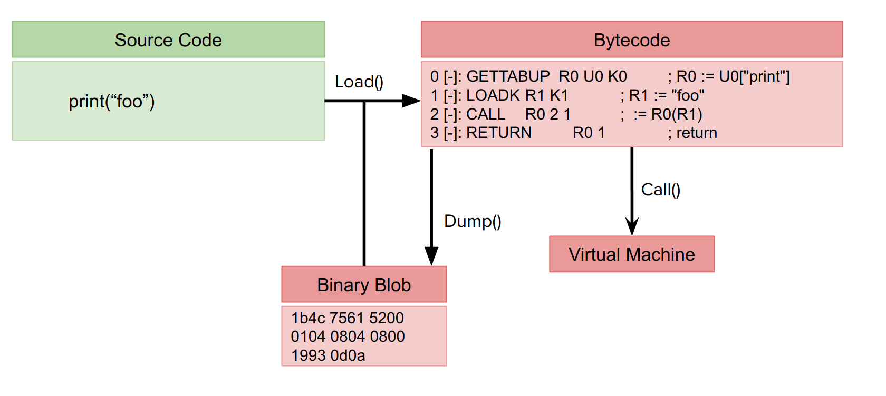

# License

Ce rapport est sous license [Creative Commons Attribution-NonCommercial-ShareAlike 4.0 International (CC BY-NC-SA 4.0)](https://creativecommons.org/licenses/by-nc-sa/4.0/) :
Vous êtes autorisé à :

* *Partager* : copier, distribuer et communiquer le matériel par tous moyens et sous tous formats 
* *Adapter* : remixer, transformer et créer à partir du matériel 


* *Attribution* : Vous devez créditer l'Œuvre, intégrer un lien vers la licence et indiquer si des modifications ont été effectuées à l'Oeuvre. Vous devez indiquer ces informations par tous les moyens raisonnables, sans toutefois suggérer que l'Offrant vous soutient ou soutient la façon dont vous avez utilisé son Oeuvre. 
* *Pas d'Utilisation Commerciale* : Vous n'êtes pas autorisé à faire un usage commercial de cette Oeuvre, tout ou partie du matériel la composant. 
* *Partage dans les Mêmes Conditions* : Dans le cas où vous effectuez un remix, que vous transformez, ou créez à partir du matériel composant l'Oeuvre originale, vous devez diffuser l'Oeuvre modifiée dans les même conditions, c'est à dire avec la même licence avec laquelle l'Oeuvre originale a été diffusée. 
* *Pas de restrictions complémentaires* : Vous n'êtes pas autorisé à appliquer des conditions légales ou des mesures techniques qui restreindraient légalement autrui à utiliser l'Oeuvre dans les conditions décrites par la licence.

# Introduction

## Le modding et son écosystème

Le modding est une pratique par laquelle un joueur va apporter une modification au comportement ou à l'aspect d'un jeu vidéo. Il peut y avoir plusieurs motivations au modding :

* étoffer le contenu du jeu (plus de créatures, de mondes, etc.)
* améliorer le confort de jeu (meilleure interface, fluidité améliorée, etc.)
* transformer le jeu en un nouveau jeu (on parle de total reconversion)
* corriger les bogues du jeu

Généralement les mods sont gratuits, et sont principalement développés par des amateurs. Lorsqu'un mod a un grand succès il arrive que le ou les développeurs l'ayant conçu monte un studio afin d'exploiter l'idée du mod de manière commerciale[^longwar].

Le modding est une pratique répandue depuis plus de 20 ans, et aujourd'hui de nombreux jeux fournissent un kit de développement (ou *SDK*), le support du modding étant même devenu un argument de vente[^1] pour les studios.

On distingue plusieurs manières de distribuer les mods :

* Plate-formes des distributeurs : La distribution des mods est intégré dans la plate-forme de vente et de gestion des jeux. La plus connue est *Steam*, aujourd'hui dominante sur le marché PC, qui propose une boutique en ligne de jeux vidéo ainsi qu'un ensemble de services liés (forums, chat, synchronisation des sauvegardes…) dont le *Steam Workshop*, une plates-forme de modding intégrée au client *Steam*. Les mises à jours y sont automatiques, et les contenus sont modérés selon les signalements des utilisateurs. Les développeurs y gagnent en temps de production car il leur suffit d'intégrer les *APIs* de *Steam* pour gérer la distribution des mods. Il s'agit aujourd'hui de la méthode de distribution de mods la plus populaire.
* Plate-formes des développeurs: certains studios choisissent d'embarquer leur propre plate-forme de distribution de mods[^2]. Cela leur permet une plus grande flexibilité mais augmente les risques de compromission de la plateforme car les moyens disponibles pour le développement sont beaucoup plus réduits.
* Plate-formes amateures : en l'absence de plate-formes officielles, la communauté s'organise pour créer leurs propres plateformes de distribution. C'est notamment le cas de *Kerbal Space Program* avec [CKAN](https://forum.kerbalspaceprogram.com/index.php?/topic/154922-ckan-the-comprehensive-kerbal-archive-network-v1270-bussard/) ou encore du site de centralisation [Nexus Mod](nexusmods.com).
* Pas de plateforme du tout : c'est le cas de *Minecraft* où les mods sont distribués sur une multitude de sites différents, sans garanties fortes sur la légitimité et la source des mods.
* Les jeux multijoueurs : Cas particulier de distribution, certains jeux multijoueurs proposant du modding permettent au serveur de charger des mods qui seront téléchargés par les clients lorsqu'ils se connectent.

L'écosystème du modding est donc très varié, avec de nombreux acteurs (studios, joueurs, moddeurs, studios de moddeurs) aux motivations diverses. Historiquement très amatrice, la fabrication des mods se professionnalise, tout comme les plate-formes de distribution grâce à l'apparition du *Steam Workshop*. 
Cependant la modération du *Steam Workshop* reposant sur le signalement par les utilisateurs laisse entrevoir des problèmes de sécurité : si un mod malveillant n'a pas un comportement suspect qui est visible de l'utilisateur final, comment les développeurs pourront-ils se rendre compte que leur jeu est utilisé comme vecteur de diffusion de maliciel ?

[^2]: C'est le cas des développeurs de *Factorio*, pour des raisons d'anti-piratage. Les mods sont accessibles uniquement aux joueurs ayant une licence valide
[^1]: Voir [Of Mods and Modders: Chasing Down the Value of Fan-Based Digital Game Modifications](https://journals.sagepub.com/doi/10.1177/1555412007307955)
[^longwar]: C'est le cas du studio [Pavonis Interactive](https://www.pavonisinteractive.com/) qui s'est créé suite au succès de son mod [Long War](https://en.wikipedia.org/wiki/Long_War_(mod)) pour le jeu XCom.

## Une pratique importante dans le jeu vidéo

Les chiffres suivant datent tous du 20 février 2020 et sont issus de [SteamSpy](https://steamspy.com/).

| Nom du jeu                           | Joueurs possédant le jeu (estimation)    | Abonnés du mod avec le plus d’abonnés     | Abonnés minimaux pour les 30 mods les plus populaires     |
|----------------------------------    |--------------------------    |---------------------------------------    |-------------------------------------------------------    |
| Cities Skyline (2015)                | 7 500 000                    | 1 327 286                                 | 300 000                                                   |
| Skyrim Special Edition (2011)        | 3 500 000                    | 1 433 952                                 | 28 700                                                    |
| Don’t Starve (2013)                  | 7 500 000                    | 880 788                                   | 150 000                                                   |
| DotA 2 (2013)                        | 150 000 000                  | 10 811 683                                | 1 500 000                                                 |
| Divinity : Original Sin 2 (2017)     | 3 500 000                    | 150 000                                   | 70 000                                                    |
| Ark Survival Evolved (2017)          | 7 500 000                    | 2 487 406                                 | 410 000                                                   |
| Civilization VI (2016)               | 3 500 000                    | 297 191                                   | 54 497                                                    |
| Garry’s mod (2006)                   | 15 000 000                   | 5 366 286                                 | 1 202 348                                                 |

On peut remarquer que les 30 mods les plus populaires représente une cible intéressante pour un pirate. En effet, s’il est possible pour un pirate de mettre en ligne un mod malveillant compromettant la machine des joueurs, la population pouvant être infecté se compte en centaines de milliers d'ordinateurs. Cependant pour que la charge utile du mod soit exécutée il faut que le joueur exécute le jeu.

| Nom du jeu                           | Pourcentage de joueurs ayant le mod le plus populaire     | Joueurs réguliers ayant le mod le plus populaire (estimation)    |
|----------------------------------    |-------------------------------------------------------    |--------------------------------------------------------------    |
| Cities Skyline (2015)                | 17,7 %                                                    | 2 041                                                |
| Skyrim Special Edition (2011)        | 41,0 %                                                    | 6 137                                                |
| Don’t Starve (2013)                  | 11,7 %                                                    | 1 705                                                |
| DotA 2 (2013)                        | 7,2 %                                                     | 28 293                                               |
| Divinity : Original Sin 2 (2017)     | 4,3 %                                                     | 380                                                  |
| Ark Survival Evolved (2017)          | 33,2 %                                                    | 15 863                                               |
| Civilization VI (2016)               | 8,5 %                                                     | 2 680                                                |
| Garry’s mod (2006)                   | 35,8 %                                                    | 8 710                                                |

On peut remarquer que la population pouvant être infectée par une compromission du mod le plus populaire est beaucoup plus faible que les chiffres initialement prévus. Il faut cependant noter qu'il ne s'agit que de jeux vidéo assez vieux (2017 pour les plus récents) et que des jeux plus récents peuvent présenter une population plus importante.

Ainsi, si les jeux vidéo s'avèrent être une cible très intéressante de part la facilité de déploiement et le nombre de victimes atteignables, il est intéressant d'étudier les mesures de sécurité mises en places par les développeurs dans le cas où ces derniers proposent des outils de modding. En effet, s'il est possible pour un mod d’exécuter du code malveillant (accès au système de fichiers, accès réseau, etc.) malgré les protections mise en place, alors les moddeurs deviennent une cible de choix pour les campagnes de phishing. En effet le système de mise à jour automatique offre un excellent vecteur de déploiement de maliciel. Les comptes *Steam* des moddeurs deviennent donc des cibles intéressantes pour les pirates.

# Étude du langage de scripting *Lua*

## Qu'est-ce que *Lua* ?

*Lua* est un langage haut niveau dit "de scripting" : son typage dynamique et son empreinte mémoire réduite le rende très propice pour la programmation gameplay, c’est-à-dire la logique régissant les mécaniques des différentes entités qui composent un jeu (joueur, ennemis, environnement…), par opposition au moteur du jeu qui expose les fonctionnalités nécessaires pour la programmation gameplay et les implémente souvent avec des langages bas niveau dans une optique de performance (gestion du rendu 3D, de la physique…). *Lua* est aujourd'hui le langage de scripting le plus utilisé dans le domaine du jeu vidéo[^lua_pop].

[^lua_pop]: Une liste non exhaustive est disponible [ici](https://en.wikipedia.org/wiki/Category:Lua-scripted_video_games)

De nombreux jeux embarquent donc un interpréteur *Lua* pour le scripting gameplay et exposent une *API* de modding également utilisable en *Lua* afin de permettre la modification du jeu. Il est donc intéressant de s'attarder sur les vulnérabilités potentielles de l'implémentation du langage car elles sont alors exploitables dans de nombreux jeux.

*Lua* est programmé en langage *C*, par une équipe de chercheurs Brésiliens, à l'université [PUC-Rio](http://www.puc-rio.br/). Le code source de l’interpréteur est de taille réduite, environ 24 000 lignes de code.

De manière générale, comme les mises à jours du langage cassent la compatibilité avec les mods, les développeurs ne mettent pas à jour l’interpréteur embarqué dans leurs jeux. Ainsi, on trouve des jeux récents encore basés sur *Lua 5.1* (2006) ou *Lua 5.2* (2012). La dernière version est *Lua 5.3* sortie en 2015, et *Lua 5.4* devrait être publiée cette année.

## Vulnérabilités

Dans cette partie nous essayons de reproduire des exploitations de *Lua* existant pour certaines depuis une dizaine d'année.
Nous nous basons principalement sur les travaux de [Peter Cawley](http://www.corsix.org/), mais aussi de quelques participants à la liste de mail *Lua*[^liste_mail] dont nous n'avons que le pseudo :

* 2010 : Peter Cawley - [Bytecode abuse module for Lua 5.2](http://www.corsix.org/lua/bytecode_abuse_0_1.lua) 
* 2013 : Peter Cawley - [Exploiting Company of Heroes 2 ‘s Lua engine (5.1)](https://gist.github.com/corsix/6575486)
* 2016 : [Exploiting the Lua engine within Redis](https://gist.github.com/benmmurphy/7d609f96deab5e297918bf9a395350e2)) by @benmurphy
* 2016 : Peter Cawley - [Exploiting Lua 5.2 64 bits on Linux](https://gist.github.com/corsix/49d770c7085e4b75f32939c6c076aad6)
* 2017 : [Escaping the Lua 5.2 sandbox with untrusted bytecode](https://apocrypha.numin.it/talks/lua_bytecode_exploitation.pdf) by [\@numinit](https://github.com/numinit)

[^liste_mail]: Notamment [cette](http://lua-users.org/lists/lua-l/2010-08/msg00487.html) discussion

### Expositions de fonctions exploitables

D'un point de vue sécurité, *Lua* adopte une démarche plutôt mauvaise. En effet, par défaut toutes les fonctions sont accessibles par les scripts utilisateurs. Si on veut isoler l'environnement d’exécution du script, il faut mettre en place un système de liste noire afin de supprimer/cacher les fonctions à risques.

Il est alors possible qu'un développeur oublie de supprimer une fonction dangereuse qui peut alors être exploitée pour sortir du contexte sécurisé.

On pense notamment à :[^liste]

* `require` pour charger des modules *Lua* qui permets par défaut de charger des librairies dynamiques
* `dofile` pour charger un script *Lua*
* le module `io`
* le module `os`
* le module `debug`

[^liste]: Une liste plus complète est disponible [ici](http://lua-users.org/wiki/SandBoxes)

### Attaques basées sur le bytecode

Lors de l’exécution d'un script, l'interpréteur *Lua* le transforme d'abord en bytecode, et c'est ce bytecode qui est exécuté par l'interpréteur Lua.
Entre chaque version majeure de *Lua*, (*5.1.4* et *5.2.4* par exemple), les développeurs ne garantissent pas la compatibilité du bytecode.

Dans la librairie standard *Lua*, on trouve plusieurs fonctions permettant de charger et compiler du *Lua* :

* `load` permet de transformer du bytecode brut (tableau d'octet) en un pointeur de fonction
* `loadstring` permet de compiler à la volée un script *Lua* (sous forme de chaîne de caractères) et renvoie un pointeur de fonction
* `string.dump` permet de récupérer le bytecode correspondant à une fonction Lua



Dans *Lua 5.2.4*, le bytecode présente plusieurs vulnérabilités pouvant être exploitées afin d’exécuter du code arbitraire.

#### Récupération des adresses des objets Lua

Dans cette partie nous allons construire une primitive permettant de récupérer l'adresse en mémoire de la structure *C* représentant un objet *Lua*.

* ***Dans un contexte non sécurisé :***

Dans l'implémentation de base de *Lua*, appeler la fonction `print` sur certains objets donne leur adresse. Ainsi, le code suivant :

```lua
function foo() end
print(foo)
```

Affiche :

> function : \<adresse de la fonction\>

Cependant cette méthode ne marche pas pour tous les types d'objets et elle est très facilement corrigeable. Nous avons donc besoin d'une autre méthode pour récupérer les adresses des objets *Lua*.

* ***Dans un contexte sécurisé :***

En *Lua*, une boucle for génère deux instructions particulières :

* `FORPREP` qui est chargée de vérifier les arguments et initialise le compteur de boucle
* `FORLOOP` qui s'occupe de toute la logique de la boucle comme compter les itérations et calculer où sauter

Ainsi, la fonction suivante :

```lua
local function foo(x)
    for i = 0, x, 1 do
        return i
    end
end
```

Donne ce bytecode (les *;* sont là pour indiquer des commentaires) :

```
    0 [-]: LOADK     R1 K0        ; R1 := 0
    1 [-]: MOVE      R2 R0        ; R2 := R0
    2 [-]: LOADK     R3 K1        ; R3 := 1
    3 [-]: FORPREP   R1 1         ; R1 -= R3; pc += 1 (goto 5)
    4 [-]: RETURN    R4 2         ; return R4
    5 [-]: FORLOOP   R1 -2        ; R1 += R3; if R1 <= R2 then R4 := R1; PC += -2 , goto 4 end
    6 [-]: RETURN    R0 1         ; return
```

Si on modifie le bytecode de cette fonction pour retirer l'instruction `FORPREP`, on peut alors passer n'importe quel objet Lua à la fonction `foo` et récupérer l'adresse de cet objet. En effet, l'instruction `FORLOOP` considère que ses arguments ont été vérifiés par l'instruction `FORPREP` et traite tous les objets *Lua* comme des valeurs numériques flottantes, même si ce n'est plus le cas. Il suffit ensuite de convertir ces dernières en entiers.

#### Écriture arbitraire dans la mémoire 

Il est possible d'exploiter les instructions générées lors de la création d'une table pour écrire dans la mémoire de manière arbitraire.

La première étape consiste en la création d'une table pointant vers l'adresse où l'on veut écrire. Pour cela, à partir de la définition C d'une table, nous créons une chaîne de caractères pouvant être interprétée comme une table dont le champ `array` pointe vers l'adresse où l'on souhaite écrire. Les autres champs ne sont pas très importants pour l'exploitation.

```C
typedef struct Table {
  GCObject *next;
  lu_byte tt;
  lu_byte marked
  CommonHeader;
  lu_byte flags;
  lu_byte lsizenode;
  struct Table *metatable;
  TValue *array;  /* Pointeur vers la zone mémoire où sont stockés les éléments */
  Node *node;
  Node *lastfree;
  GCObject *gclist;
  int sizearray;  /* Taille du tableau */
} Table;

```

Ensuite nous allons manipuler le bytecode afin que notre chaîne de caractères soit interprétée comme une table.


L'instruction `SETLIST` est une instruction générée lors de la création d'une table. Si l'on considère le code *Lua* suivant :

```lua
function bar(tt, k)
    tt = {k}
end
```

On obtiens le bytecode suivant :

```
0 [-]: NEWTABLE  R2 1 0       ; R2 := {} (size = 1,0)
1 [-]: MOVE      R3 R1        ; R3 := R1
2 [-]: SETLIST   R2 1 1       ; R2[0] := R3 ; R(a)[(c-1)*FPF+i] := R(a+i), 1 <= i <= b, a=2, b=1, c=1, FPF=50
3 [-]: MOVE      R0 R2        ; R0 := R2
4 [-]: RETURN    R0 1         ; return
```

L'implémentation de `SETLIST` est censée vérifier que son argument est bien une table, cependant cette vérification est faite par une assertion de débogage. Or, pour des raisons de performances, la plupart des développeurs compilent *Lua* en mode production ce qui fait disparaître les assertions de débogage.

Ainsi si l'on supprime l'instruction `NEWTABLE` dans le bytecode généré, il est possible de fournir à la fonction `bar` un argument `tt` de n'importe quel type qui sera interprété comme une table. L'instruction `SETLIST` va ensuite aller écrire la valeur `k` à l'adresse spécifié dans la table. Si l'on passe notre chaîne de caractères malicieuse, on contrôle alors la destination de l'opération d'écriture.

#### Lecture arbitraire dans la mémoire 

En utilisant les primitives développées précédemment il est possible d'aller lire de la mémoire arbitraire ainsi :

1. Créer une table avec un élément
2. Modifier l'adresse du champ `array` de la table en utilisant la primitive d'écriture mémoire pour y inscrire l'adresse où l'on souhaite lire
3. À ce moment, lire le premier élément de la table nous permets de lire à l'adresse que l'on a fournie à l'étape 2

#### Exécution de code arbitraire

* ***En modifiant le pointeur de fonction de l'allocateur mémoire :***

En *Lua* une structure de donnée contient l'état du thread global. Dans cet état on trouve notamment un pointeur de fonction vers l'allocateur mémoire. L'idée de l'exploitation est de retrouver cette structure et de modifier le pointeur de fonction pour le faire pointer vers le shellcode.


*Lua* étant un langage *garbage collected*, tous les objets ont un en-tête comportant notamment un pointeur vers l'objet précédemment alloué. L'objet représentant l'état du thread est le premier objet alloué.

```C
/*
** Common Header for all collectable objects (in macro form, to be
** included in other objects)
*/
#define CommonHeader    GCObject *next; lu_byte tt; lu_byte marked
```

Ainsi, à partir d'un objet alloué dynamiquement (comme une table ou une fonction) il est possible, en utilisant les primitives développées précédemment, de remonter la liste des objets alloués jusqu'à arriver à l'objet contenant l'état du thread.

On peut alors réécrire le pointeur de fonction et sauter dans le shellcode la prochaine fois que l'interpréteur allouera de la mémoire.

* ***En fabriquant un objet représentant une fonction C :***

*Lua* supporte différents types de fonctions, dont les fonctions *C*. Ainsi, on se propose d'exploiter ce comportement en utilisant les primitives mémoires développées précédemment. La démarche est la suivante :

1. Déclarer une fonction
2. Changer son type de *Lua Function* vers *Light C Function*
3. Modifier la valeur du pointeur de fonction pour pointer vers le shellcode
4. Appeler la fonction


##### Problèmes

Dans les deux cas, le shellcode étant stocké dans le tas, il s'agit d'une section qui n'est pas exécutable on ne peut donc pas sauter dans notre shellcode pour l’exécuter.

Il faudrait donc mettre en place du ROP pour obtenir une exploitation complète.

## Renforcement et sécurisation de l'interpréteur Lua

Un renforcement simple mais efficace employé par les développeurs de *Factorio* pour éviter qu'un moddeur malicieux récupère l'accès à un module ou une fonction en liste noire et de retirer le code correspondant à leur implémentation avant de compiler *Lua*. De même certaines fonctions sont éditées pour retirer l'affichage de l'adresse des objets en mémoire, ou empêcher le chargement de modules en dehors du dossier du mod. Aussi, la fonction `require` a été éditée pour ne pas charger les librairies dynamiques.

En l'absence de vérifieur de bytecode (*Lua* en comportait un qui à été retiré en version *5.1* car non maintenu et incomplet), la seule solution garantissant l'impossibilité d'exploiter le bytecode est d’en empêcher le chargement. Les développeurs de *Roblox*, un jeu basé sur le partage de mondes et modes de jeu créés par les utilisateurs (où le modding fait donc partie du principe même du jeu) ont fait ce choix[^roblox_bc], sacrifiant ainsi une partie des performances (les fichiers doivent être parsés systématiquement) pour plus de sécurité et de flexibilité (les scripts restent compatibles entre les versions mineures de Lua).

Pour conclure, Peter Cawley propose [un guide](https://www.lua.org/wshop11/Cawley.pdf) (datant de 2011) afin de mitiger les risques lors du chargement de bytecode potentiellement malicieux.

[^roblox_bc]: Voir le post de blog "[Bye Bye bytecode](https://blog.roblox.com/2012/08/bye-bye-bytecode/)"

# Vulnérabilités

## Absence totale de sécurité

Il nous a été très étonnant de constater que dans un grand nombre de cas, la plate-forme de modding proposée par les développeurs n'offre aucune forme de sécurisation pour le joueur : beaucoup de jeux basés sur le moteur généraliste Unity3D permettent par exemple de compiler un mod sous forme de librairie dynamique chargée à l'exécution sans aucune restriction (le scripting d'*Unity* étant basé sur la plate-forme *.NET*, des protections telles que *AppDomain* existent mais ne sont pas supportées par le moteur).

C'est d'autant plus inquiétant qu'aucune différence n'est faite dans l'interface du *Steam Workshop* entre les mods comportant uniquement des modèles 3D, et ceux intégrant du code. Un joueur peut donc installer un mod pensant qu'il va lui proposer un nouveau bâtiment, alors qu'en réalité c'est un logiciel rançonneur.

Même dans le cas où les développeurs semble fournir un contexte sécurisé pour l'exécution des mods, il arrive souvent que la communauté créée des extensions non officielles pour l'*API* de modding, qui contiennent des vulnérabilités ou permettent des comportements dangereux comme le chargement de librairies dynamiques. Ainsi en ajoutant la plateforme de modding *Forge* au jeu *Minecraft*, il devient possible de manipuler des fichiers ou encore effectuer des requêtes *HTTP*.

On retrouve le même problème sur *Skyrim*, où l'extension [Skyrim Script Extender (SKSE)](https://skse.silverlock.org/) permets aux mods de charger des librairies dynamiques.

## Chaînes de formats

Les vulnérabilités de chaîne de format permettent, de part une mauvaise utilisation des fonctions de la famille `printf`, à l'utilisateur de passer un chaîne contenant des marqueurs qui seront interprétés par la fonction et fournissent alors la possibilité de lire et écrire dans la pile (`%p` permet la lecture de la pile et `%n` l'écriture, contrôlée par le nombre de caractères déjà affichés). Ce type de vulnérabilité peut notamment se retrouver dans des parseurs de scripts ou de ligne de commande intégrées au jeu.

Ainsi, dans le moteur utilisé par *Bethesda* (le *Creation Engine*) depuis 18 ans, on trouve une [vulnérabilité par chaînes de formats](https://www.gironsec.com/blog/2013/05/exploit-in-skyrim/) dans le code s'occupant de parser les commandes tapées dans la console. Cependant, même si le moteur a été utilisé dans de nombreux jeux populaires (dont *Oblivion*, *Skyrim* et *Fallout 4*) les moddeurs n'ont pas accès à la console à travers l'API de modding.

## Mauvaise isolation des mods

Souvent, les langages utilisés pour offrir des accès aux *APIs* du jeu propose un système de dépendances (tel que `require()` en *Lua*). Les développeurs ne pensent pas toujours à re-écrire ce type de fonction afin de les restreindre au dossier d'un mod. Ainsi, les moddeurs peuvent retrouver un contexte d’exécution non sandboxé en re-important les fonctionnalités désactivées.

Il peut aussi arriver que ce type de restriction soit implémenté, mais gère mal certains aspects techniques des systèmes de fichiers comme les liens symboliques relatifs ou encore le caractère *`..`* .

# Charges utiles intéressantes

## Proxy réseau

Infecter le PC d'un joueur par le biais d'un mod de jeu ayant des fonctionnalités multijoueur peut permettre à l'attaquant d'obtenir une porte dérobée lui permettant d'attaquer le réseau local de ce joueur.
Lorsqu'un joueur souhaite héberger une partie, il lui faut souvent créer des redirections de ports manuellement sur son routeur. En effet beaucoup de jeux multijoueurs reposent sur des ports prédéfinis en mode serveur (par exemple *Minecraft* écoute sur le port *25 565*).
Souvent, ces redirections persistent après la partie car les joueurs ne les suppriment pas. Un mod malveillant ayant réussi à s'installer sur l'ordinateur du joueur possède donc un moyen de contourner le filtrage du routeur fourni par le FAI.

Enfin, le réseau local d'une victime infectée peut contenir d'autres appareils connectés plus intéressants à pirater que l'ordinateur. L'ordinateur compromis peut donc servir de relais afin d'atteindre ces appareils.

## Maliciel

Il est intéressant de prendre en compte l'environnement dont disposent les joueurs PC potentiellement ciblés par une attaque par mod malicieux : leur configuration matérielle comprend souvent une carte graphique très puissante, ce qui peut s'avérer très utile pour miner certaines cryptomonaies.
De plus les jeux présents sur leurs comptes sur les plates-formes de distribution (*Steam*, *Epic Games*, *GOG*…) se comptent en dizaines voire centaines, la valeur monétaire des comptes intéresse donc les attaquants dans une optique de revente (le phishing est d'ailleurs à ce titre un problème endémique sur *Steam*).
Il arrive également que ces comptes soient utilisés pour de la triche dans des jeux en ligne, afin que le compte volé soit banni en cas de détection plutôt que le compte du tricheur.

Souvent, les joueurs de jeux en lignes possèdent une bonne connexion internet (une centaine de *Mo/s* pour les plus chanceux). Les joueurs sont donc une cible très intéressante pour les attaquants souhaitant se créer un réseau de zombie dans l'optique de monter des attaques de déni de service réseau.

# Renforcement et sécurisation

## Utilisation d'un langage dédié

Certains studios de jeu (notamment ceux responsables de grosses productions) créent leur propre langage de scripting et exposent ce dernier aux moddeurs. C'est le cas des jeux de *Blizzard* et *Bethesda* avec des langages tels que *Galaxy* ou *Papyrus*. La sécurisation est alors plus facile de part l'approche *bottom-up* dans la construction du langage : des fonctionnalités ne sont ajoutées que si elles sont strictement nécessaires à la réalisation du jeu. *Valve* prend une approche hybride avec *VScript*, une machine virtuelle qui gère les acteurs du jeu et interagit avec le moteur, et peut être contrôlée depuis différent langages selon les bindings utilisés. Enfin, certains développeurs créent leur propre implémentation d'un langage existant, comme pour le *Minecraft Script Engine* qui est un interpréteur *Javascript*.

## Limitation des mods

Certains systèmes de modding prennent le parti de se tourner vers une approche déclarative : c'est le cas de la version multiplate-forme de *Minecraft*, qui utilise des fichiers *JSON* dans lequel le moddeur déclare des conditions et les événements pour réagir à ces conditions, le jeu exposant la totalité de ses comportements sous forme d’événements et donnant également accès à un moteur d'évaluation d'expression arithmétiques. Le jeu permet tout de même le chargement de scripts *Javascript* mais le joueur doit activer pour cela les fonctionnalités expérimentales et recevra un avertissement lors du lancement de sa partie.

# Conclusion

Au travers de ce projet de recherche nous avons pu faire un tour d'horizon des pratiques typiques dans l'implémentation des systèmes de modding de jeux, et étudier les vulnérabilités et possibles exploitations que l'on y retrouve. Notre travail sur *Lua* nous a permit d'étudier en détail un système de scripting et nous a notamment montré la possibilité de créer des exploitations génériques, réutilisables entre plusieurs jeux.

De manière générale, nous avons pu voir que le modding reste un domaine où la sécurité n'est pas forcément une priorité, bien que la position des développeurs sur ce sujet puisse varier. C'est pourquoi nous avons pensé que faire le travail de sécurisation en amont, avec par exemple la création de sandboxs correctement sécurisées prêtes à être incorporées dans des moteurs de jeux pour les langages de scripting les plus populaires, pourrait être une mitigation intéressante au problème des vulnérabilités dans le modding.
